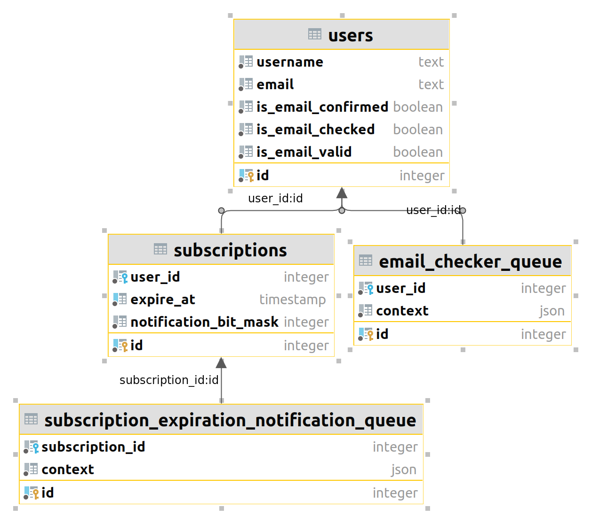

**Поставленная задача**

Разработать сервис для рассылки уведомлений об истекающих
подписках.
За один и за три дня до истечения срока подписки, нужно отправить
письмо пользователю с текстом "{username}, your subscription is expiring
soon".
Имеем следующее
1. Таблица в DB с пользователями (5 000 000+ строк):
   **username** Имя пользователя

   **email** Емейл

   **validts** unix timestamp до которого действует ежемесячная
   подписка, либо 0 если подписки нет

   **confirmed**
   0 или 1 в зависимости от того, подтвердил ли
   пользователь свой емейл по ссылке (пользователю
   после регистрации приходит письмо с уникальный
   ссылкой на указанный емейл, если он нажал на
   ссылку в емейле в этом поле устанавливается 1)
   checked Была ли проверка емейла на валидацию (1) или не
   было (0)

   **valid** Является ли емейл валидным (1) или нет (0)
2. Около 80% пользователей не имеют подписки.
3. Только 15% пользователей подтверждают свой емейл (поле confirmed).
4. Внешняя функция **check_email**( $email )
   Проверяет емейл на валидность (на валидный емейл письмо точно
   дойдёт) и возвращает 0 или 1. Функция работает от 1 секунды до 1
   минуты. Вызов функции стоит 1 руб.
5. Функция **send_email**( $from, $to, $text )
   Отсылает емейл. Функция работает от 1 секунды до 10 секунд.

Ограничения
1. Необходимо регулярно отправлять емейлы об истечении срока
   подписки на те емейлы, на которые письмо точно дойдёт
2. Можно использовать cron
3. Можно создать необходимые таблицы в DB или изменить
   существующие
4. Для функций check_email и send_email нужно написать "заглушки"
5. Не использовать ООП
6. Очереди реализовать без использования менеджеров

---

**Документация**
1. запуск сервиса
```
docker-compose up
```
- при запуске сервиса единоразово будет сгенерировано 5 млн. пользователей и 1 млн. подписок (20% от общего числа пользователей)
- подразумевается, что будет 5 млн. уникальных email и username (уникальные индексы не добавлял, т.к. в данной задаче они не нужны)
- 15% пользователей будут иметь подтвержденную почту
- 6% пользователей будут иметь невалидную почту (процент взял из головы, т.к. не знаю нужной статистики)
- время истечения подписки равномерно распределено на будущие 30 дней (в реальности конечно подписки могут быть и на более длительный промежуток и распределены не равномерно)
- генерация займет некоторое время (должно быть не больше минуты)
2. схема данных 
3. в кроне запускаются email_checker_cron.php и notification_cron.php для наполнения очереди; email_checker_queue_consumer.php и notification_queue_consumer.php для разгроба и разгрёба очереди 
4. [сиквенс диаграмма](https://sequencediagram.org/index.html#initialData=C4S2BsFMAJHwQQBEEHwggmEEKwg9BcIIBhBqH4QRg4iCBCIINIg0gvCA6AsIIoIIgRgwiC7l1GAyIAFAcCGAxsAHsATtABEvIQIB2wbgCNR0bgGdoAYQBKHAA7choXiF0yxE6dGUSjwRSvU69Bo9xOiAjgFdIXi1e02lVQBFB30QQ2NgMQARACFbVTiuLikBYBgBADdIEU1oAC5oAHkAZWh6LHhGVCJyjHhADhBcWu0AC20uCUhudPtNAFoAPjVCwHYQLFwGWmwausbm6EQqBvJoeCxR6GQ8dAaljjUhuIK8REBuEAYCLFRAHhBy3AbaRAxT4mhAORBR9BQAGmgGaAYRBERDwEiAURBTlQHtMGnVQYhoDQzoA2EHIZHGQPIBAaRFogHkQLbQIioAiocgNVDQACMgGYQRAAegAzJCqORUIBOEAAOlI4QCgSCwZD2bV8FQiGh4CiqOSGoT8MQyGcGoBGEERiEo0FQgEkQKns6AqkhnHC4JCS8lYDhxIYje6PZ6vWqa00odAYBhcZS6XgwLiHQbHQo0FVYZBnfG3cqIRAq3UUvUms1ugHbQjoVBUNjQA42jT5Dhevi+gAmkGUwEkAE97Bwuj0YCEBoMgmMJlMZrVpvMnahpuc2EC1hsiTcVgxGCk0hlsiIWxQsFczoiiOtyJjAGIgDQaHCCR1ihRV6buuHQyEQVKeMbjlOgDU2afgGbhtGgADEihpoABVAAK0QAggAKgAotAJQANIAJI-tAAAyRRqOBwHRD8PLEDGZBUPADD0hyeBIOuvYvvUGo4PqyCjPiZzEgCKJUuMMKcNazZBlg5Dohe0axrK+KTr0WQ5NAc4upKEbHoQjC3osKosGGYnQIAIiDGrScIiW6cJwsgWDKmyrCqRJZCfOglqpPxM5CYUWKoOuxKrhuW4Ft6JZlhWAjVkEQA) проверки почты
- кратко флоу такой:

  -- добавляем почты в очередь, по которым нет проверки

  -- берем сообщения из очереди, проверяем почты и обновляем флаги проверки почты

  -- добавляем почты в очередь, по которым нет проверки

  -- ...
4. [сиквенс диаграмма](https://sequencediagram.org/index.html#initialData=C4S2BsFMAJHwQQBEEHwggmEEKwg9BcIIBhBqH4QRg4iCBCIINIg0gvCA6AsIIoIIgRgwiC7l1GAyIAFAcCGAxsAHsATtABEvIQIB2wbgCNR0bgGdoAYQBKHAA7choXiF0yxE6dGUSjwRSvU69Bo9xOiAjgFdIXi1e02lVQBFB30QQ2NgMQARACFbVTiuLikBYBgBADdIEU1oAC5oAHkAZWh6LHhGVCJyjHhADhBcWu0AC20uCUhudPtNAFoAPjVCwHYQLFwGWmwausbm6EQqBvJoeCxR6GQ8dAaljjUhuIK8REBuEAYCLFRAHhBy3AbaRAxTqgenl4bT4mhAORBR9AoAA0FBwGEQREQ8BIqAoDEAbCAsRZEXDrZANdh4R5sG6IRZ4RqARhAzg14VhfoBJEFutEA8iDQR5EVAEVDkBpfZDwW4sr74N6PDANDhxIYje6PZ6vd4SnmEWqUZGorDIDAMLG0HFYLjKXS8GBcQ6DY6FGiEpVnGm3cqIRCEqms2Hy1EodAqraLZmcqhsaAHEUafIcbV8PUAE0gymAkgAnvYOF0ejAQgNBkExhMpjNatN5nLUNNzmxwWsNm6bisGIwUmkMtkRKnQVczniiOtyOMMIAxEDZHCCR1ihUJ6EtuHQyEQsKeNrtDVhDU2hCHy3K0AAYkUNNAAKoABWiAEEACoAUWgJQA0gBJbfQAAyRTUZ6P0SBAB0pMQbWQqPAGIBmEEQgCcIASiAdnmtDQPUiDyuQsLIKMNJnNAjDQPCsLjO8nDCimxpYOQ5AwlaU7cjSVa9FkOTQPWEKKsg5rDtiNw4PKDDYOMeEML8b5fDaLC0RadyEhiKAcdAjHTKq1FogKaoatA4wQVB9Q1CwsLgiSzL0GO0BUDBQE0PS9BMsRkr8g0IIfoSZAwQqaLmpi+DIJC8AsBwqRkbWlGFOCMEdkhrbtl2gpBrqPphhG0aUUAA) отправки письма
- кратко флоу такой:

  -- добавляем почты в очередь, по которым можно и нужно отправить письмо

  -- берем сообщения из очереди, отправляем письма и проставляем флаг отправки письма

  -- добавляем почты в очередь, по которым нужно отправить письмо

  -- ...
5. разделил проверку почты и отправку письма, чтобы не блокировать в некоторых случаях запись пользователя на время отправки письма (потенциально 10 секунд), в комментариях в email_checker_queue.php указано 
6. в комментариях в файлах email_checker_cron.php и notification_cron.php есть комментарии на тему того, почему запускается то или иное количество крон скриптов для очередей
7. сделал запуск консюмеров очереди просто через множественный запуск одного и того же скрипта через крон
- альтернатива - запуск процессов через systemctl/supervisord
8. конфиг крона лежит в docker/php/crontab
- сейчас крон запускается раз в 10 минут
9. не стал разбивать файлики по папкам типа domain, infrastructure и т.п. и выделять какие-то контексты; в общем очень по простому организовал
